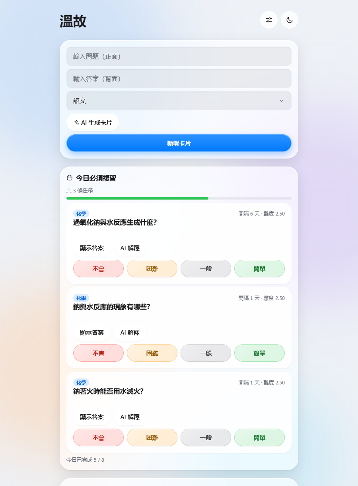
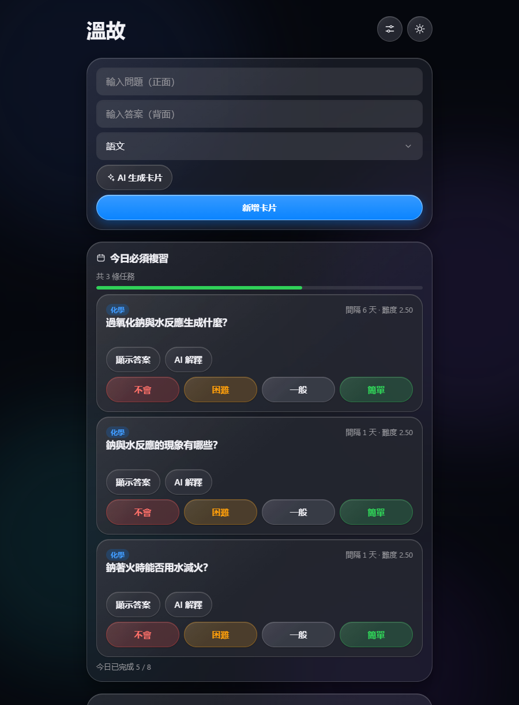
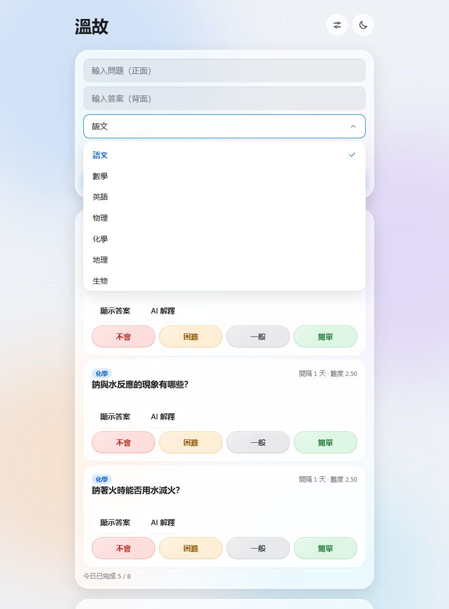
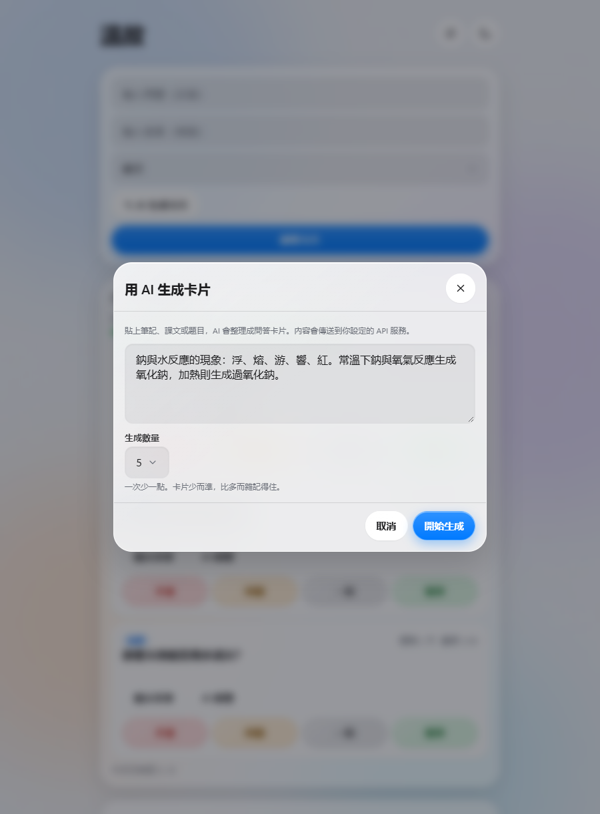
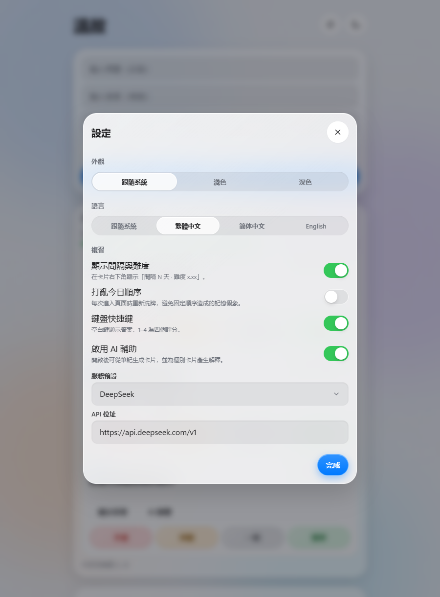

# 溫故 · Wengu

> 溫故而知新。 —— 《論語·為政》

**溫故**是一套本地優先的間隔複習卡片。名字取自《論語》：回頭溫習舊的，才拿得到新的——這正是間隔複習在做的事。

沒有帳號、沒有伺服器、沒有遙測。卡片只存在這台裝置的瀏覽器裡，隨時能匯出成一份 JSON；整個專案是一堆原生 ES 模組，沒有打包步驟，推到 GitHub Pages 就能跑。設計遵循一套叫「液態玻璃」（iOS 26）的規範，寫在 [`DESIGN.md`](DESIGN.md)。可以完全離線使用，也可以接上任何 OpenAI 相容的模型，讓它把筆記拆成卡片、替你講解答錯的那一張。

> 一個資料夾就能跑，也可以直接部署到 GitHub Pages。
> English summary at the [bottom](#english).

## 畫面



左上是輸入區（問題／答案／科目），下面是今天到期的卡片：每張卡有題目、顯示答案、四個評分，以及一條今日進度。整個介面是玻璃材質——卡片浮在有顏色的壁紙上，上緣有一道高光。

| 深色模式 | 分類下拉 |
|---|---|
|  |  |

| AI 生成卡片 | 設定 |
|---|---|
|  |  |

下拉選單是自製的（原生 `<select>` 的展開清單由作業系統繪製，跟玻璃材質衝突）；貼一段筆記就能讓模型拆成卡片；設定裡有外觀、語言、複習行為、科目、AI 與資料。

> 這些截圖不是手拍的：`npm run shots` 會用示範資料重跑一遍並重新產生（走 Chrome DevTools Protocol，不需要額外安裝瀏覽器）。改動 UI 之後重跑就好。

---

## 為什麼是這樣做的

- **本地優先**：卡片存在 `localStorage`，沒有帳號、沒有伺服器、沒有遙測。匯出的 JSON 完全是你自己的。
- **零建置**：原生 ES 模組，沒有打包器。改了檔案重新整理就生效，推到 GitHub Pages 也不用 CI 編譯。
- **設計有規範**：整個介面照 [`DESIGN.md`](DESIGN.md) 的液態玻璃 token 實作——玻璃三件套、同心圓角、動效時長全部來自同一組 CSS 變數，改一個地方就同時改到 CSS 與 JS 動畫。

## 功能

| 分類 | 內容 |
|---|---|
| 卡片 | 新增／編輯／刪除（可撤銷）／搜尋／科目篩選／拖曳排序 |
| 科目 | 內建六個（語文／數學／英語／物理／化學／地理）＋ 可自訂；還有卡片在用的科目不給刪 |
| 複習 | SM-2 排程、四個評分（不會／困難／一般／簡單）、今日進度條 |
| 設定 | 外觀（跟隨系統／淺色／深色）、語言、複習選項、AI、資料 |
| 語言 | 繁體中文、简体中文、English（首次開啟跟隨瀏覽器語言） |
| AI | 從筆記生成卡片（生成後可勾選）、為單張卡片產生解釋 |
| 資料 | 匯出／匯入 JSON（合併模式會以 id 去重） |
| 快捷鍵 | 空白鍵揭示答案，`1`–`4` 評分 |
| 無障礙 | 支援 `prefers-reduced-motion` 與 `prefers-reduced-transparency`，觸控目標 ≥ 44px |
| 質感 | 玻璃材質、跟隨指針的光斑、標題上的反相光標透鏡 |

## 快速開始

### Windows：雙擊 `start.cmd`

在專案資料夾雙擊 **`start.cmd`** 就好。它會啟動本機伺服器並自動開瀏覽器，視窗關掉就結束。需要 Node.js（[下載](https://nodejs.org/)），沒有裝的話腳本會直接告訴你。

### 其他平台／手動啟動

```bash
node scripts/serve.mjs        # 內附，只用 Node 內建模組，不需要 npm install
python -m http.server 4173    # 有 Python 也可以
npx serve .                   # 或任何靜態伺服器
```

然後開 <http://localhost:4173/>；埠被占用時會自動往後找一個（4174、4175…），以終端機印出的網址為準。`node scripts/serve.mjs --no-open` 可以關掉自動開瀏覽器。

### 為什麼不能直接雙擊 `index.html`

這個專案用原生 ES 模組，而瀏覽器基於 CORS 會擋掉 `file://` 下的模組載入（來源是 `null`）。這是瀏覽器的安全規則，不是檔案壞了。真的雙擊了也不會一片空白——頁面會顯示一張說明卡告訴你怎麼做。

部署到 GitHub Pages 之後就沒有這個限制，那是有真正 http 來源的環境。

**部署到 GitHub Pages**：

1. 推到 GitHub（預設分支 `main`）。
2. 倉庫 **Settings → Pages → Source** 選 **Deploy from a branch**。
3. 分支選 `main`、資料夾選 `/ (root)`，存檔。一兩分鐘後就會在
   `https://<你的帳號>.github.io/<倉庫名>/` 上線。

這是純靜態站、沒有建置步驟，所以不需要 Actions ——也就不需要給你的推送權杖
`workflow` 權限。（想改用 Actions 自動部署的話，自己加一份
`.github/workflows/pages.yml` 即可。）

> 想改成 `使用者名稱.github.io/專案名/` 這種子路徑也不用改程式——所有資源都是相對路徑。

## 接入 LLM

設定 → **AI 輔助** → 啟用，然後填三樣東西：

| 欄位 | 說明 |
|---|---|
| API 位址 | 服務的 base URL，會自動接上 `/chat/completions` |
| 模型 | 例如 `deepseek-chat`、`gpt-4o-mini` |
| API 金鑰 | 只存在你的瀏覽器 |

內建幾個預設可直接選：DeepSeek、OpenAI、OpenRouter、Ollama（本機）。

**金鑰儲存方式**（設定裡可選）：

- `永久儲存`：寫進 `localStorage`，下次開啟還在。
- `僅本次瀏覽`（預設）：寫進 `sessionStorage`，關掉分頁就沒了。
- `不儲存`：只留在記憶體，重新整理就要重填。公用電腦請選這個。

金鑰**永遠不會**出現在匯出的 JSON 裡——它在 store 中是獨立於 settings 的一份資料。

### 如果連線一直失敗

瀏覽器直連 API 會受 **CORS** 限制：對方的伺服器必須允許你的來源。DeepSeek、OpenAI、OpenRouter 通常可以；有些服務則會擋。遇到 `連線失敗` 時：

- 先確認 API 位址結尾是不是 `/v1`（腳本會自動補 `/chat/completions`，不要自己填完整路徑）。
- 用設定裡的 **測試連線** 按鈕，它會做一次最小往返，錯誤訊息會指出是網路、狀態碼還是解析問題。
- 仍然不行就換一個允許跨來源的端點，或自架一個薄代理。

### 送出什麼資料

啟用 AI 時，**只有你當下送出的內容**會離開本機：生成卡片時是你貼上的那段文字，產生解釋時是那一張卡的問題與答案。其餘的卡片、統計、設定一律不會上傳。

## 鍵盤快捷鍵

| 按鍵 | 動作 |
|---|---|
| `空白鍵` | 顯示／隱藏第一張待複習卡片的答案 |
| `1` | 不會 |
| `2` | 困難 |
| `3` | 一般 |
| `4` | 簡單 |
| `Enter` | 在問題輸入框按 Enter 直接新增卡片 |
| `Esc` | 關閉對話框 |

快捷鍵可在設定裡關掉；在輸入框內打字時不會觸發。

## 資料格式

匯出檔長這樣，可以直接編輯後再匯入：

```json
{
  "app": "wengu",
  "schemaVersion": 1,
  "exportedAt": "2026-09-18T12:00:00.000Z",
  "items": [
    {
      "id": 1758100000000,
      "question": "光合作用的產物是什麼？",
      "answer": "葡萄糖與氧氣",
      "category": "化學",
      "repetition": 2,
      "interval": 6,
      "easeFactor": 2.5,
      "lapses": 0,
      "reviews": 2,
      "createdAt": "2026-09-10T03:00:00.000Z",
      "lastReviewed": "2026-09-16T03:00:00.000Z",
      "nextReview": "2026-09-22T03:00:00.000Z"
    }
  ],
  "subjects": [
    { "id": "s-m1abc2", "name": "生物" }
  ],
  "settings": { "appearance": "system", "locale": "auto", "review": {}, "llm": {} }
}
```

`category` 存的是科目 id。內建六個的 id 就是那幾個中文字串（`語文 / 數學 / 英語 / 物理 / 化學 / 地理`）——它們不隨介面語言改變，介面上只換顯示文字。自訂科目則形如 `s-m1abc2`，名稱放在 `subjects` 陣列裡；**改顯示名稱不會動到既有卡片**，因為卡片認的是 id。

`subjects` 只放自訂科目（內建的不列）。匯入採合併：同名的自訂科目只會留一個。

舊版（專案還叫 `smart-review` 時）存在瀏覽器裡的資料會自動搬到新的鍵名，舊資料不會被刪除；舊匯出檔也能直接匯入。

匯入採**合併**模式：`id` 已存在的卡片會被略過，所以同一份檔案重複匯入不會產生重複卡片。

## 專案結構

```
.
├── index.html                  唯一頁面
├── DESIGN.md                   設計系統（token 的單一來源）
├── src/
│   ├── main.js                 進入點：組裝與事件接線
│   ├── store.js                狀態 + localStorage + 遷移 + 匯出匯入
│   ├── srs.js                  SM-2 排程（純函式）
│   ├── i18n.js                 三個語系字典與 t()
│   ├── llm.js                  OpenAI 相容客戶端與提示詞
│   ├── lens.js                 光標透鏡（canvas + difference 混合）
│   ├── motion.js               動效工具，時長讀自 CSS token
│   ├── config.js               版本號等常數
│   ├── styles/
│   │   ├── tokens.css          顏色／字級／間距／圓角／動效時長
│   │   ├── app.css             版面、玻璃材質、元件
│   │   └── motion.css          動效與透鏡
│   └── ui/
│       ├── render.js           三個主區塊的渲染
│       ├── select.js           原生 select → 主題化下拉（原生留在 DOM 當資料來源）
│       ├── settings.js         設定面板
│       ├── ai.js               AI 生成與解釋
│       └── toast.js            吐司（含撤銷）
├── tests/smoke.mjs             冒煙測試（198 項）
├── docs/screenshots/           README 用的產品截圖（由 npm run shots 產生）
├── scripts/
│   ├── serve.mjs               本機靜態伺服器
│   ├── gen-spring.mjs          彈簧曲線產生器 → src/styles/spring.css
│   ├── shoot.mjs               產生 README 截圖（走 Chrome DevTools Protocol）
│   ├── inspect.mjs             視覺巡檢：13 個狀態各拍一張
│   ├── lib/browser.mjs         CDP 驅動（Node 內建 WebSocket，零依賴）
│   ├── lib/demo.mjs            示範資料（截圖與巡檢共用）
│   ├── check-design.mjs        DESIGN.md 結構檢查
│   ├── check-tokens.mjs        自訂屬性雙向檢查（CSS 定義 ↔ JS 寫入 ↔ 引用）
│   └── check-contrast.mjs      WCAG 對比度（依實際堆疊順序合成）
└── legacy/                     v0 單檔版本，保留作為歷史
```

## 開發

```bash
npm install          # 只裝測試用的 jsdom，執行時不需要任何依賴
npm test             # 198 項冒煙測試：純邏輯 + 把整個 app 掛進 jsdom 跑一遍流程
npm run serve        # 本機預覽
npm run shots        # 重新產生 README 的產品截圖（需要 serve 開著）
npm run inspect      # 視覺巡檢：13 個狀態各拍一張到 .inspect/（可加關鍵字只跑部分）
npm run lint         # 設計文件 + 自訂屬性 + 對比度，一次驗完
npm run lint:design  # 檢查 DESIGN.md 是否還和程式碼對得上
npm run lint:tokens  # 抓出打錯或漏定義的 var(--x)，以及抄了兩份的重複色值
npm run lint:contrast # 依實際堆疊順序算每一組前景／背景的 WCAG 對比
```

測試刻意不用「開真瀏覽器」的方式：jsdom 不執行 `<script type="module">`，所以測試是先把 DOM 裝成全域、再直接 import 同一份模組。測到的就是瀏覽器實際跑的那份程式碼。

### 看畫面

邏輯測試看不到「空狀態用了綠色」「提示膠囊壓住按鈕」這類問題——那些得用眼睛看。`npm run shots` 與 `npm run inspect` 都是驅動本機已安裝的 Chrome（**不下載任何瀏覽器**），塞入示範資料後把各狀態拍成 PNG：

- `npm run shots` → `docs/screenshots/`，README 用的五張，會進倉庫。
- `npm run inspect` → `.inspect/`，開發檢視用的十三張（含拖曳到一半、游標透鏡等互動狀態），不進倉庫。可以只跑一部分：`npm run inspect -- english`。

截圖是**可重現的**：同一份程式碼跑兩次會產生逐位元相同的 PNG（產生器會等彈簧動畫完全停下才拍）。

### 想改設計時

1. 先改 `DESIGN.md` 的 token 與規則。
2. 再改 `src/styles/tokens.css`（數值的唯一來源；JS 動畫也讀這裡）。
3. `npm run lint` 確認文件結構沒壞、而且每一組顏色的對比都還在門檻之上。

`lint:contrast` 會自己合成背景（玻璃疊底色再疊淡色底），所以它驗的是畫面上真正出現的那個顏色，不是 token 字面上的值。改動任何顏色後都跑一次。

## 已知限制

- **CORS**：能不能直連取決於對方服務，不是這個專案能決定的。需要時請自架代理。
- **需要本機伺服器**：用原生 ES 模組的代價，直接雙擊 `index.html` 會被瀏覽器擋下（見上方快速開始）。想單檔攜帶請用 `legacy/` 裡的 v0 版本。
- **沒有雲端同步**：資料在這台裝置的這個瀏覽器裡。換裝置請用匯出／匯入。
- **不是行動 App**：它是網頁，加到主畫面會像 App，但沒有原生推播提醒。
- **測試不涵蓋視覺**：冒煙測試驗的是邏輯與 DOM 結構，`backdrop-filter`、光標透鏡這類渲染效果沒有自動化驗證，改了要自己看一眼。

## 授權

[MIT](LICENSE)

---

## English

**Wengu** (溫故, from the Analects: *review the old to learn the new*) is a local-first spaced-repetition flashcard app with a Liquid Glass (iOS 26) interface.

- **No build step.** Plain ES modules — serve the folder with any static server (`node scripts/serve.mjs`) or push `main` to GitHub Pages as-is. Opening `index.html` over `file://` will not work: browsers block module loading from a null origin.
- **Your data stays local.** Cards live in `localStorage`; the exported JSON is yours. Nothing is uploaded unless you explicitly use an AI feature.
- **Optional AI.** Point it at any OpenAI-compatible endpoint (DeepSeek, OpenAI, OpenRouter, or a local Ollama) to generate cards from your notes and explain individual cards. The API key lives in its own storage slot and is never included in exports.
- **Three languages.** Traditional Chinese, Simplified Chinese, and English.
- **Accessible by default.** Honors `prefers-reduced-motion` and `prefers-reduced-transparency`; all touch targets are at least 44px.

```bash
npm install && npm test    # 198 smoke tests
npm run serve              # http://localhost:4173/
```

The interface follows the design tokens documented in [`DESIGN.md`](DESIGN.md).
